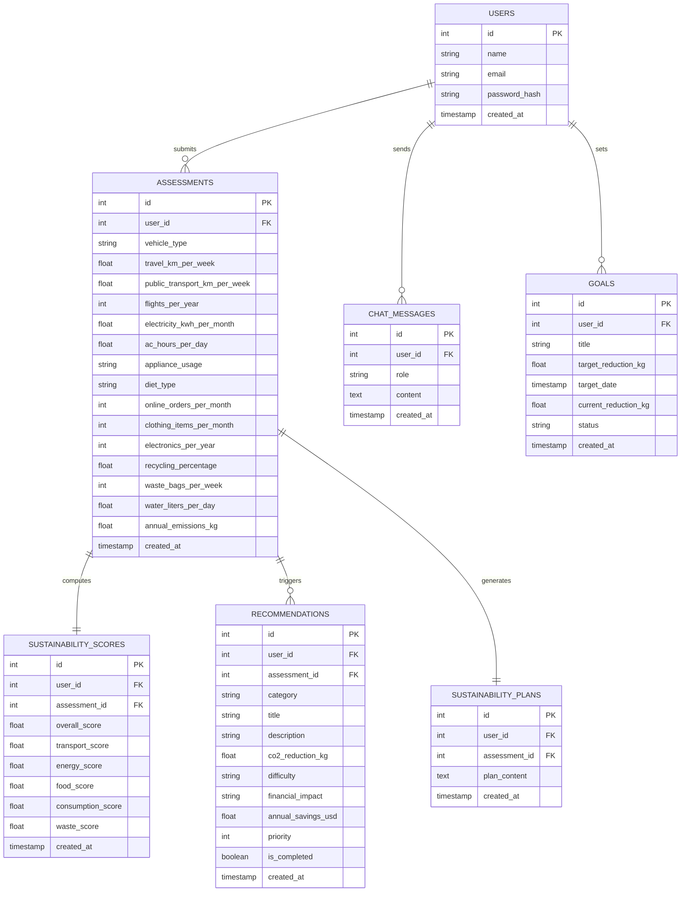

# EcoTrack 🌱 — Intelligent Carbon Footprint & Sustainability Assistant

EcoTrack is a production-grade, hackathon-ready sustainability platform designed to help users track, analyze, and systematically reduce their environmental footprint. Rather than functioning as a static calculator, EcoTrack acts as a personalized sustainability coach, featuring a dynamic frontend, an asynchronous database abstraction layer (supporting both SQLite and PostgreSQL), and a dual-engine AI assistant powered by **Google Gemini 2.0 Flash**.

---

## 🚀 Key Features

* **Intelligent Carbon Assessment**: Multi-category questionnaire spanning transport, energy, food, consumption, waste, and water usage with real-time scientific calculations.
* **Persistent AI Chat History (Option A)**: A full-featured chat assistant with message history persisted to the database, allowing seamless session resumption and context-aware chat.
* **Gamified Leaderboard & Social Savings Counter (Option B)**: Social engagement system that ranks users by their total carbon savings and tracks completed ecological recommendations.
* **AI-Generated Custom Action Plan (Option C)**: An executive 30-to-90-day custom sustainability roadmap generated on-demand by Gemini, broken down by difficulty and impact.
* **Dual-Engine AI Abstraction**: Integrates Google Gemini 2.0 Flash for semantic understanding and roadmapping, with a robust local rule-based fallback system if API limits are reached.
* **Hybrid Database Adapter**: Unified backend data layer supporting zero-config local SQLite (using Node's native compile-free `node:sqlite` module) and remote PostgreSQL/Supabase.

---

## 🏗️ Architecture & System Flow

EcoTrack utilizes a decoupled client-server architecture. The frontend is built with React and Vite, while the backend is a Node.js Express server.

### 🔄 System Flow Diagram

```mermaid
sequenceDiagram
    autonumber
    actor User as User (Client)
    participant Server as Express Server
    participant AI as Gemini 2.0 API
    database DB as Database (Postgres/SQLite)

    User->>Server: Submit Carbon Assessment
    Server->>Server: Calculate Emissions (Scientific Formulas)
    Server->>Server: Compute Category & Overall Scores
    Server->>DB: Persist Assessment & Recommendations
    DB-->>Server: Saved Data
    Server-->>User: Return Scorecard & Dashboard Metrics

    User->>Server: Ask AI Assistant / Request Action Plan
    Server->>DB: Load User Footprint & Chat History
    DB-->>Server: User Profile & Context
    Server->>AI: Send Prompt + Profile + Context (Gemini 2.0)
    Note over Server,AI: Fallback to Local Rule Engine if 429/Error
    AI-->>Server: Structured Markdown Output
    Server->>DB: Log AI Response / Save Action Plan
    Server-->>User: Render Custom AI Roadmap / Message Bubble
```

### 🗄️ Relational Database Schema



---

## 🧮 Scientific Methodology

EcoTrack computes annual carbon footprints using peer-reviewed global average emission factors:

### 1. Transport Emissions
$$E_{\text{transport}} = \left( \text{distance}_{\text{vehicle}} \times F_{\text{vehicle}} + \text{distance}_{\text{transit}} \times F_{\text{transit}} \right) \times 52 + \text{flights} \times F_{\text{flight}}$$
* **Petrol Car ($F_{\text{vehicle}}$)**: $0.21 \text{ kg CO}_2\text{/km}$ | **Diesel Car**: $0.17 \text{ kg CO}_2\text{/km}$ | **Electric Car**: $0.05 \text{ kg CO}_2\text{/km}$
* **Public Transit ($F_{\text{transit}}$)**: $0.04 \text{ kg CO}_2\text{/km}$ | **Short-Haul Flight ($F_{\text{flight}}$)**: $255 \text{ kg CO}_2\text{/flight}$

### 2. Energy Emissions
$$E_{\text{energy}} = \left( \text{electricity}_{\text{kWh}} \times F_{\text{grid}} + \left( \text{AC}_{\text{hours}} \times 1.5 \text{ kW} \times F_{\text{grid}} \right) \times 30 \right) \times 12 \times M_{\text{appliances}}$$
* **Grid Factor ($F_{\text{grid}}$)**: $0.42 \text{ kg CO}_2\text{/kWh}$ (global average grid intensity)
* **Appliance Multiplier ($M_{\text{appliances}}$)**: Low ($0.8$), Moderate ($1.0$), High ($1.3$) based on appliance age and efficiency.

### 3. Diet, Consumption, Waste & Water
* **Diet (Annual)**: Vegan ($1,500\text{ kg}$), Vegetarian ($1,700\text{ kg}$), Mixed ($2,500\text{ kg}$), High-Meat ($3,300\text{ kg}$).
* **Consumption**: Online Orders ($19\text{ kg/order}$), Clothing ($14\text{ kg/garment}$), Electronics ($300\text{ kg/device}$).
* **Household Waste**: $2.5\text{ kg CO}_2\text{/bag/week} \times 52 \times \left(1 - \text{recycling percentage}\right)$.
* **Water Usage**: $0.0003 \text{ kg CO}_2\text{/liter/day} \times 365$.

---

## 💯 Score & Recommendation Algorithm

### Sustainability Scoring
Each carbon category is scored from $0$ to $100$ relative to global averages. A score of $50$ represents a standard user, scores approaching $100$ indicate optimal sustainability, and lower scores represent high-emission profiles:
$$\text{Category Score} = \max\left(0, \min\left(100, 100 - \left(\frac{\text{User Emissions}}{\text{Average Emissions}} \times 50\right)\right)\right)$$
$$\text{Overall Score} = 0.30 \cdot S_{\text{transport}} + 0.25 \cdot S_{\text{energy}} + 0.20 \cdot S_{\text{food}} + 0.15 \cdot S_{\text{consumption}} + 0.10 \cdot S_{\text{waste}}$$

### Dynamic Recommendation Engine
Over 15+ situational recommendations are filtered, weighted, and prioritized according to the user's specific answers:
* Submitting a petrol vehicle with travel > $100\text{ km/week}$ triggers carpooling or public transport alternatives.
* Low recycling percentages trigger localized recycling guides.
* High meat consumption triggers meatless-day programs.

---

## 💻 Tech Stack & Design Aesthetics

* **Frontend**: React 18, Vite, TypeScript, Tailwind CSS, Recharts (data visualizations), React Router 6.
* **Backend**: Node.js, Express, SQLite (`node:sqlite`), Postgres Client (`pg` pool).
* **AI integration**: Google Generative AI SDK (Gemini 2.0 Flash) with custom contextual prompt wrapping and instant local fallback.
* **Design & Aesthetics**: Sleek glassmorphism theme (`backdrop-blur-xl bg-white/5 border border-white/10`) with emerald-400 gradients, custom transitions, and interactive micro-animations.
* **Accessibility (a11y)**: Screen-reader semantic HTML5 structures, descriptive focus states, unique DOM IDs, explicit form labels, and high-contrast color codes for Recharts data.

---

## 🛠️ Installation & Setup

### Prerequisites
* **Node.js v22+** (Fully optimized and tested on Node.js v26)

### 1. Environment Configuration
Copy the `.env.example` at the root of the project to a new file named `.env` in the `server/` directory:
```bash
cp .env.example server/.env
```
Fill in the configuration details:
* To use local SQLite, leave `DATABASE_URL` commented out.
* To use remote PostgreSQL, set `DATABASE_URL` to your connection string.
* Add your `GEMINI_API_KEY` to enable AI features.

### 2. Start the Backend API Server
```bash
cd server
npm install
npm run dev
```
The server will run on `http://localhost:3001` and automatically execute database migration schemas.

### 3. Start the Frontend Client
```bash
cd client
npm install
npm run dev
```
The frontend application will start on `http://localhost:5173`. API requests are automatically proxied via Vite config.

---

## 🧪 Testing

Both frontend and backend include independent, comprehensive Vitest test suites.

### Run Backend Tests (56 Cases)
Includes tests for carbon calculation logic, score weighing, recommendation triggers, and mock API integration:
```bash
cd server
npm test
```

### Run Frontend Tests (18 Cases)
Verifies React layout structures, Multi-step wizard forms, gauges, and dashboard state:
```bash
cd client
npm test
```

---

## 🚀 Production Deployment (GCP Cloud Run)

The application is fully containerized and production-ready.

### Manual Cloud Run Deployment
To deploy using Google Cloud CLI, run from the `server/` directory:
```bash
cd server
gcloud run deploy ecotrack \
  --source . \
  --project=crested-talon-497314-v6 \
  --region=us-central1 \
  --allow-unauthenticated \
  --set-env-vars="JWT_SECRET=your-secure-jwt-secret,GEMINI_API_KEY=your-gemini-key,DATABASE_URL=your-supabase-connection-string"
```

### Security & Scaling in Production
* **Advisory Locks**: Backend migrations use session-level PostgreSQL advisory locks (`pg_advisory_lock`) to prevent race conditions during concurrent serverless container startup.
* **Connection Pooling**: Restricts pool size (`max: 5`) to prevent serverless scaling from exhausting Supabase connection limits.
* **Production Secret Checks**: Server halts immediately on startup in production if `JWT_SECRET` is missing or matches default development keys.
* **Rate Limiting**: Integrated `express-rate-limit` prevents brute-force abuse of AI and auth routes.
* **SQLite Fallback Persistence (Volume Mounts)**: When the server falls back to SQLite, it writes the database to `/tmp/carbon_footprint.db` to survive serverless read-only restrictions. To make the database survive container lifecycles in production, you can configure Google Cloud Run to mount a persistent Cloud Storage bucket or dynamic NFS share (Filestore) to `/tmp` via **Cloud Run Volume Mounts**.
* **Experimental Warning Suppression**: Built-in SQLite database uses Node's native `node:sqlite` module. Start scripts utilize the `--no-warnings` flag to ensure the console output remains clean of experimental feature notices.
* **Reduced Motion Accessibility**: Fully respects visual accessibility standards. When a user has `prefers-reduced-motion` enabled in their OS, all css hover transforms, loaders, and page transitions are automatically disabled.
